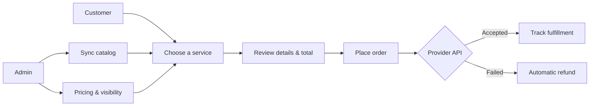

<div align="center">

# ⚡ BoostSync

### A fast, mobile-first control center for social growth services

[](https://boostsync-smm.atxenx.chatgpt.site)
[](https://nextjs.org)
[](https://react.dev)
[](https://www.typescriptlang.org)
[](https://developers.cloudflare.com/d1/)

**[Explore the live app](https://boostsync-smm.atxenx.chatgpt.site)** · **[Browse services](https://boostsync-smm.atxenx.chatgpt.site/services)**

</div>

---

## What is BoostSync?

BoostSync is a modern SMM panel for discovering services, placing orders, managing wallet credit, and tracking delivery from one clean interface. It includes a customer dashboard, provider integrations, and a complete administration workspace—designed to feel natural on desktop and mobile.

> [!NOTE]
> This repository is a product starter and demonstration. Connect a verified provider and a production payment gateway before using it with real funds or customer orders.

## Highlights

| Experience | What it includes |
| --- | --- |
| 📱 **Mobile first** | Responsive screens, touch-friendly controls, safe-area support, and an app-style bottom navigation |
| 🛍️ **Clear ordering** | Category and service selection, full service details, price per 1,000, quantity limits, and live totals |
| 💳 **Wallet ledger** | Balance overview and transaction history for deposits, purchases, refunds, and adjustments |
| 🔌 **Provider sync** | Generic SMM API adapter for importing services, submitting orders, and checking provider balances |
| 📈 **Dynamic pricing** | Percentage or fixed markup rules with customer pricing calculated on the server |
| 🛡️ **Admin workspace** | Manage providers, services, users, balances, orders, visibility, and availability |
| 🌏 **Localized UI** | English and Thai language support across the public and authenticated experience |
| ⚙️ **Automated recovery** | Order synchronization and automatic refund handling for failed provider requests |

## Product flow



## Tech stack

| Layer | Technology |
| --- | --- |
| Application | Next.js 16, React 19, TypeScript |
| Styling | Tailwind CSS 4, Base UI, Lucide icons |
| Authentication | Auth.js 5 with credential sessions |
| Data | Prisma ORM 7 with the Cloudflare D1 adapter |
| Runtime | Vinext, Vite, Cloudflare Workers |
| Database | Cloudflare D1 / SQLite |
| Deployment | OpenAI Sites |

## Quick start

### Prerequisites

- Node.js 20 or newer
- npm
- A Cloudflare D1-compatible development environment

### 1. Install

```bash
git clone <your-repository-url>
cd smm
npm install
```

### 2. Configure environment variables

Create a `.env` file:

```env
AUTH_SECRET="replace-with-a-long-random-secret"
DATABASE_URL="file:./dev.db"

# Optional AI-powered service helper
GEMINI_API_KEY=""
```

Generate a strong authentication secret with:

```bash
openssl rand -hex 32
```

### 3. Prepare Prisma

```bash
npx prisma generate
```

The hosted app receives its `DB` binding from `.openai/hosting.json`. Local D1 settings live in `vite.config.ts`.

### 4. Run the app

```bash
npm run dev
```

Open [http://localhost:4000](http://localhost:4000).

### 5. Create the first administrator

Register the first account in a fresh database. BoostSync assigns the first user the `ADMIN` role; every account created afterward starts as `USER`.

## Useful commands

```bash
npm run dev          # Start the Next.js development server on port 4000
npm run build        # Build the Cloudflare Worker with Vinext
npm run build:next   # Run a standard Next.js production build
npm run lint         # Check code quality
npx prisma generate  # Regenerate Prisma Client
```

## Project structure

```text
src/
├── app/
│   ├── (auth)/            # Sign in and registration
│   ├── admin/             # Administration workspace
│   ├── api/               # Auth, payment simulation, and scheduled sync
│   └── dashboard/         # Customer dashboard, orders, services, and wallet
├── components/
│   ├── admin/             # Admin management components
│   ├── dashboard/         # Responsive dashboard and mobile navigation
│   └── ui/                # Reusable interface primitives
└── lib/
    ├── actions/           # Server actions and business workflows
    ├── providers/         # SMM provider adapter
    └── utils/             # Pricing and shared utilities

prisma/schema.prisma       # Application data model
drizzle/                   # D1-compatible SQL migrations
vite.config.ts             # Vinext and Cloudflare Worker configuration
```

## Security checklist

- Never commit `.env`, API keys, session secrets, or production credentials.
- Replace the simulated checkout route before accepting real payments.
- Encrypt provider API keys at rest; the current provider model is a starter implementation.
- Add request rate limiting and audit sensitive administrator actions.
- Use a payment provider with cryptographically verified webhooks.
- Review Cloudflare D1 transaction limitations before processing real balances at scale.

## Deployment

BoostSync is configured for OpenAI Sites and Cloudflare D1. A production build is generated with:

```bash
npm run build
```

The live deployment is available at **[boostsync-smm.atxenx.chatgpt.site](https://boostsync-smm.atxenx.chatgpt.site)**.

## Contributing

Contributions are welcome. Create a focused branch, keep changes small, and include verification notes with your pull request.

```bash
git checkout -b feature/your-feature
git commit -m "Add your feature"
git push origin feature/your-feature
```

## License

No open-source license has been added yet. All rights are reserved unless a license is provided by the repository owner.

---

<div align="center">

Built with care for a fast, clear, and friendly ordering experience.

**BoostSync** · Sync your growth ⚡

</div>
